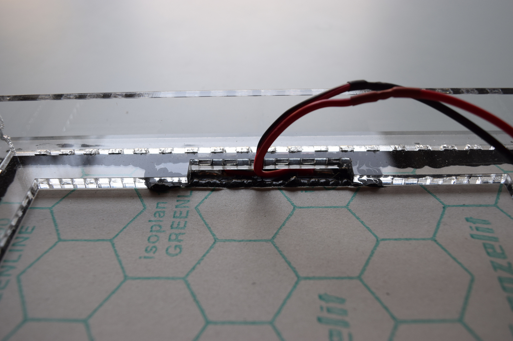

# Heating plate base

Components:

1. Part `A` of the cases
2. Part `B` of the cases
3. Dichloromethane
4. Heating plate
5. Isolation for heating plate
6. Black silicone
7. 2 pin connector.

Tape all parts together and glue with dochloromethane, in the top of this case you need to paste the isolation and heating plate both like the picture:

For the connector, you need to use a width cable that tolerate more than 4 A, and solder correctly:

:::caution
Be sure that you use the correct connector for the heating plate.
:::

:::tip
Try to avoid any contact between case and heating plate using the silicone.
:::

