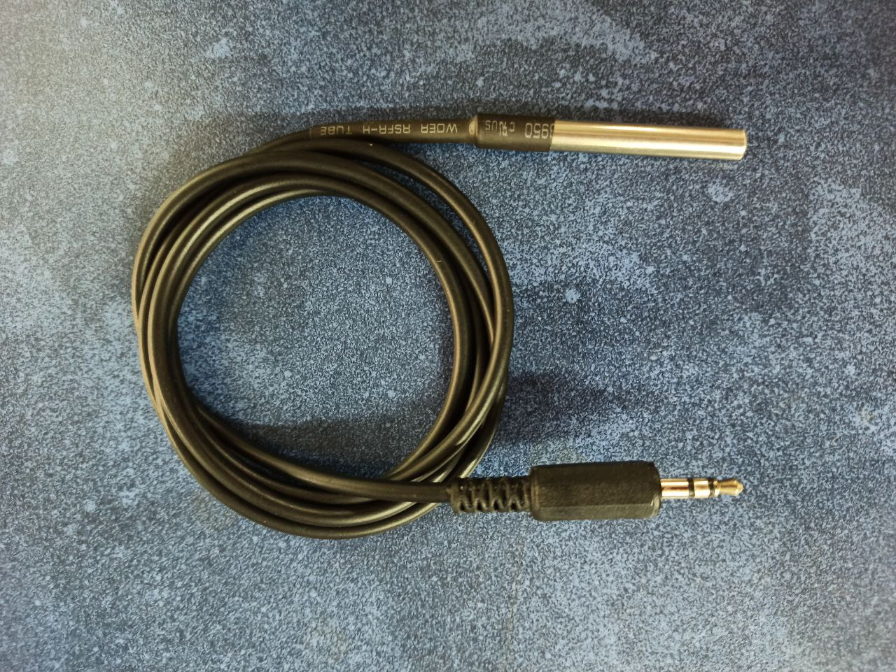

# One-wire Probes

## Internal probe

There is an internal probe to check the PCB temperature, the IC [DS18B20](https://datasheets.maximintegrated.com/en/ds/DS18B20.pdf) is the component in charge of do it and it's near to the PID component.

## External probe

The external probe is connected using a jack 3.5mm:

:::warning
If you made the connection by yourself between the DS18B20 probe and jack connector, be sure that you weld correctly every cable like the image. In other case, you can't read the temperatrue!
:::

