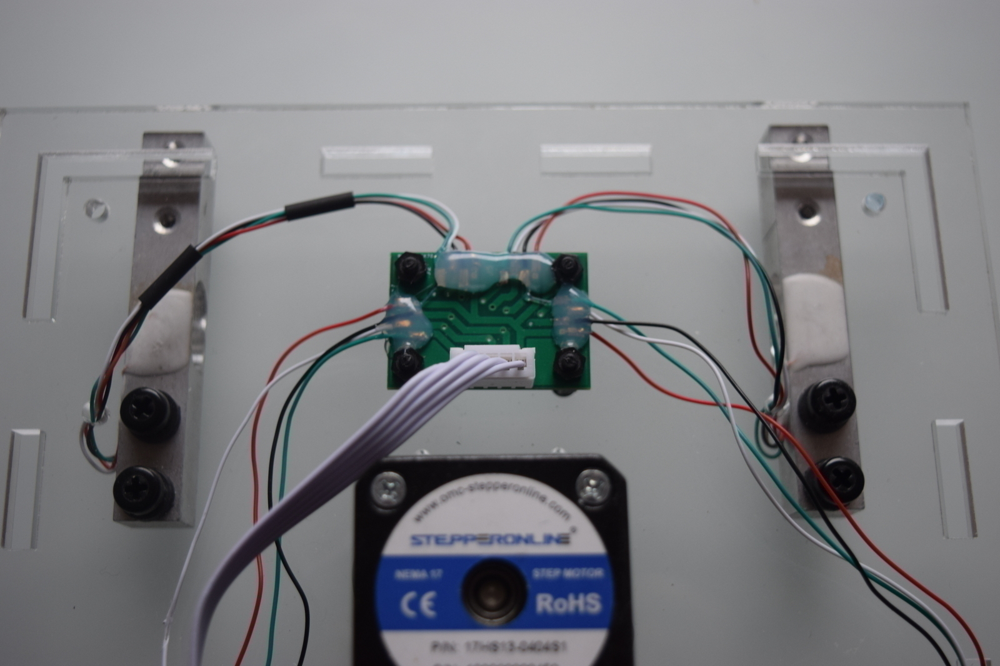

# Load cell

The weight is determined using 4 loading cells connected in parallel.

Those loading cells are connected to a load cell PCB:

After this, the PCB is connect to the main board through a 5 poles connector as shown in the
following picture:

