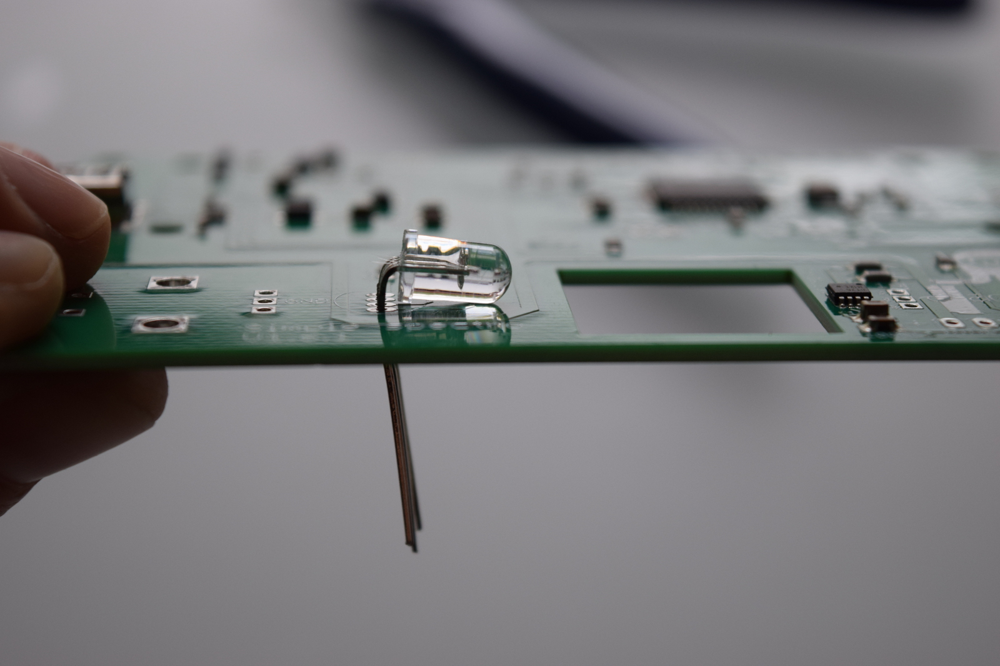
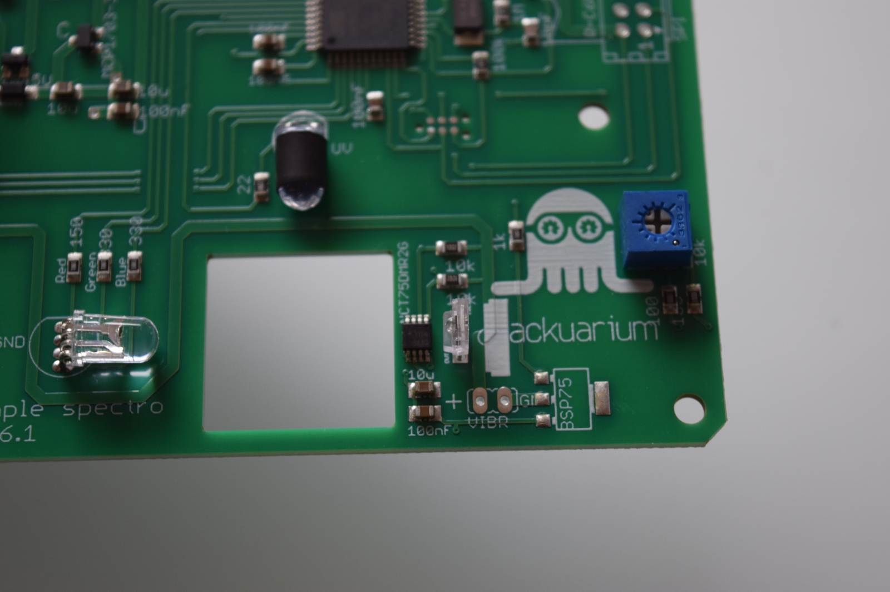
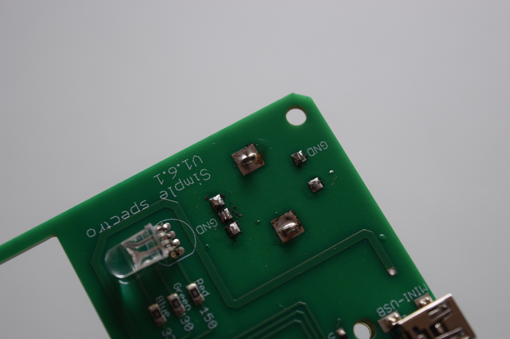
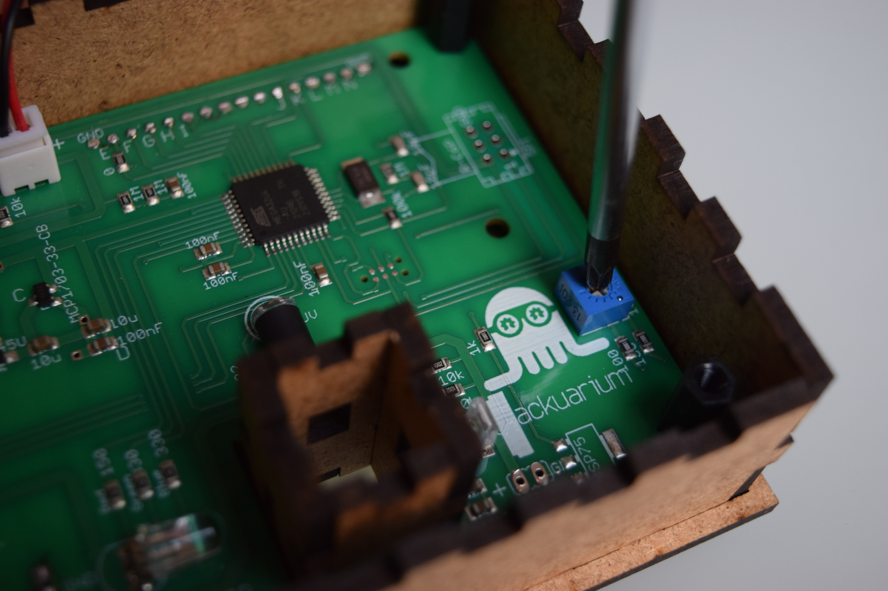
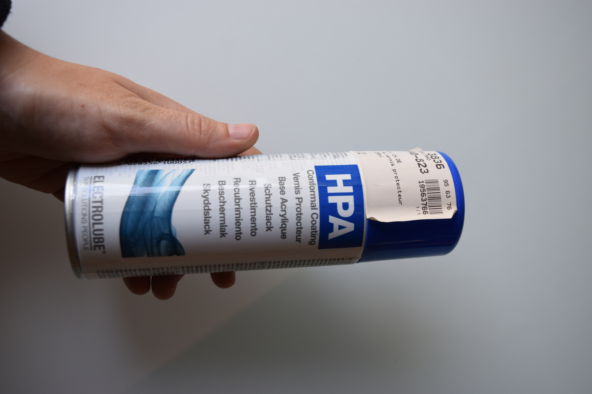

# Soldering the PCB

The first step in the construction of the spectophotometer is to solder the electronic board. The board actually comes pre-soldered with all of the surface mounted (SMD) components, but the through-hole components have to be soldered by hand. Don't worry if you've never soldered anything: the process is relatively simple.

First, take all the component of bag B out. You should have the following components in front of you:

1. Potentiometer
2. Battery connector
3. Light detector
4. UV LED (with the black strip around it)
5. RGB LED
6. Rotary push button
7. LCD screen
8. Single row straight pins header for the screen

You can take the PCB out of it's bag. The PCB has two faces, which well refer to as face 1 and face 2. Be careful which components are soldered on which face!

You can now turn your soldering iron on and set it on around 350 degrees Celcius.
:::caution
The iron's really hot, so don't burn yourself, it hurts...
:::

:::info
Solder generally contains lead, which is toxic. Avoid breathing in any fumes and wash your hands carefully after you finished soldering.
Here, we had some solder with 37% of lead (Pb).

:::

So now that the warnings were made, let's jump right in.

## 1) Pins on screen

The first step is to solder the array of pins on the LCD screen. Place the pins in the wholes on the screen board and solder all the pins. Be sure to have the pins well perpendicular to the screen.

:::tip
To ensure that the pins are perpendicular to the screen, first solder one pin, then correct the position if necessary by reheating the solder you just made. Then solder the remaining pins.

:::

You can now leave the screen on the side for a bit: we used it as a soldering warm-up.

## 2) Potentiometer

Next, take the board on face 1 and solder the potentiometer in place. Cut the pins short using the wire cutter once soldered. From now on you can cut the pins of all the components that will be soldered. All the next components will be on face 1, until specified otherwise.

## 3) UV LED

Again, be careful with the orientation. Bent the LED like you did with the previous one.

## 4) RGB LED

:::info
Be careful when soldering the LEDs: for these components, the orientation matters! You can recognize the minus pin of an LED because it is the shortest one, and because there is a flat on that side of the LED. You can feel it with your fingers if you roll the LED between them.
:::

Start by placing the RGB LED on the board in the correct orientation, but don't push until the LED is against the board. Gently bend the pins of the LED towards the square hole until you get an angle of 90 degrees. Now make the side of the LED touch the board and solder it in place.

## 5) Light detector

The light detector's orientation is also important. You must place the face with the little bump towards the square hole. Be sure that it's well perpendicular to the PCB before soldering all the pins.

## 6) Battery connector

Put the connector on the battery and place the connector on the board in the right orientation (red cable on plus). Remember the orientation, then remove the battery and solder.

:::caution
Be really careful to orient the connector correctly: the red cable of the battery must be on the + pin on the board.
:::

## 7) Screen

:::warning
Check if your are putting the Screen over its image on **Face 2** of the PCB!!!
:::

Turn the PCB around to be soldering on face B. Take the screen and solder it in place.

## 8) Rotary push button

:::warning
Check if your are putting the Rotary push button over its image on **Face 2** of the PCB!!!
:::

Finally, solder the rotary push button. Start by soldering the 5 small pins and the finish by filling the two large holes with solder. But do that only when you have verified that the button is placed well!

## Test the PCB and set contrast

At this point, you're basically over with the soldering, congrats! You should now plug the battery in the spectrophotometer and check that it work properly. At this point, you also have to set the contrast of the screen. To do that, use the screwdriver to turn the potentiometer until the text is clearly lisible on the screen.

## Optional: Add protective coating

Optionally, if you have some PCB protective coating, it's time to use it now. Lightly spray the board on one face and let dry. Then repeat for the other face.

:::caution
The protective coating is relatively toxic, so use it only in a very well ventilated place (ideally outside).
:::

## Next

You're now finished with the electronics part of the construction. Click "Next" to start assembling the case.
