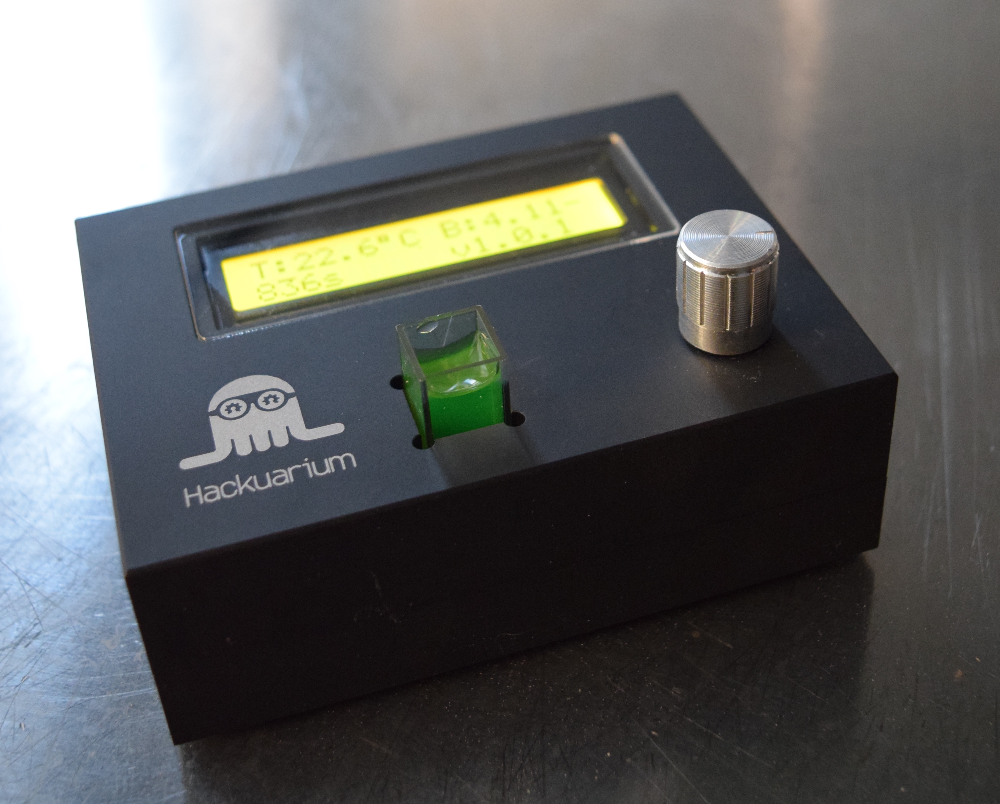

# The case

The case was designed using OpenSCAD. While it is likely not the easiest program to use it is quite fun, at least for some, because you actually just write code. OpenSCAD is open-source.

Currently we have 2 versions of the case:

- A box that is designed to be cut using a laser cutter in 3mm MDF or acrylic glass.
- The closed-box is designed for the top and bottom parts to be screwed together. It can be made by aluminum milling (or can also be 3D-printed).

## First prototype using 3D printer

First prototypes were done using 3D printer and you can see here some images:

## Laser cut case

Laser cutting is likely the faster way to prototype a case.

## Milled aluminum case

