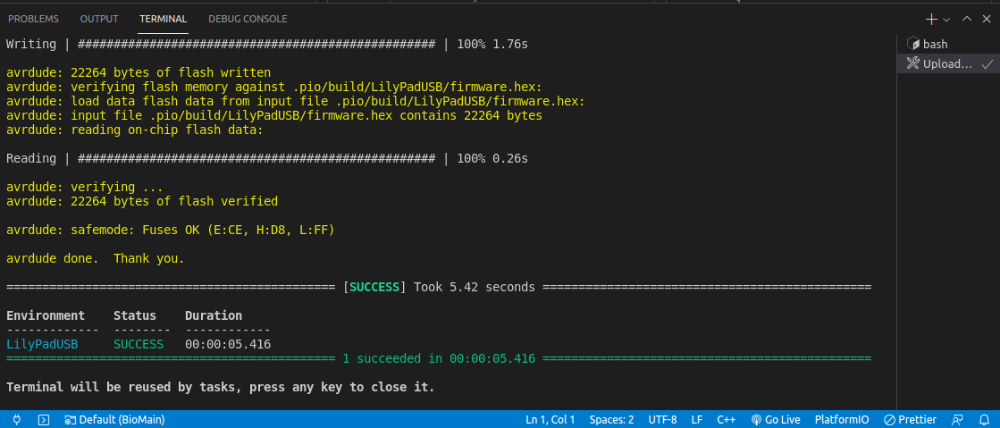

# Installation

## Cloning the project

### Requirements

1. Git (^2.25.1)
2. Visual Studio Code (^1.61.2)

You know with age we take some habits and it would be easier if you follow the same ones ...

All our github projects are always in a folder called `git`
which is at the first level of the `home` directory. It is followed by the
name of the github user/organisation and finally the project name.

So, to install the project from bash:

```bash
mkdir -p ~/git/hackuarium/
cd ~/git/hackuarium/
git clone https://github.com/Hackuarium/bioreactor-platformio.git
```

The possibility to clone the project will require that you validate your public key
in github!

## Installing the PlatformIO plugin

In VSCode you need to open `Extensions` tab or press `(CTRL+Shift+X)`, and search ´PlatformIO IDE´ to install it:


## Hardware support for Leonardo 8MHz = LilyPad Arduino USB

The version `6.0.1` of the bioreactor is operating at 8MHz/3V3 instead of the standard 16MHz/5V.

If you do any mistake and try flashing the bioreactor board as if it was a normal Leonardo, you will be able to flash the program but the USB port will not be recognized anymore afterwards. You will have to reflash the bootloader!!!

## Using USBtiny

By default the last version of Fedora will only give you a USB readonly access and will prevent you from burning the bootloader.

In order for the USBTiny to have r/w access you should add a USB rule:

```bash
# UDEV rule for Arduino ISP R3 programmer board,
# to prevent having to run Arduino IDE as root to get it to program.
# Copy this file to /etc/udev/rules.d so

SUBSYSTEMS=="usb", ATTRS{idVendor}=="1781", ATTRS{idProduct}=="0c9f", GROUP="plugdev", MODE="0666"
```

## Libraries

In this project, we use many non standard libraries. By default PlatformIO IDE
will look for them in `<Project>/include`.

If you are using only our project it is easier to directly point this folder
to the libraries that are present in the github.

```bash
$: mkdir ~/libraries/
$: ln -s ~/git/hackuarium/bioreactor-platformio/BioMain/include/hack/libraries/ ~/libraries/
```

Warning: Time library update v1.5.0 change committed in BioMain including TimeLib.h instead of Time.h resolves bugs on OSX

## That's it

You should now be able to compile the project from PlatformIO IDE.

You can now proceed with burning the bootloader using the `program_via_USBtinyISP` environment created in `platformio.ini` file. Go to `platformIO Terminal` and type:

```bash
$: pio run -e program_via_USBtinyISP --target bootloader
```

Once you have the bootloader, you can upload your code with `PlatformIO: Upload` button:


You can check upload success in the same terminal:



# The parameters

In order to control the bioreactor you should have a look at the description of the [parameters](parameters.md).
