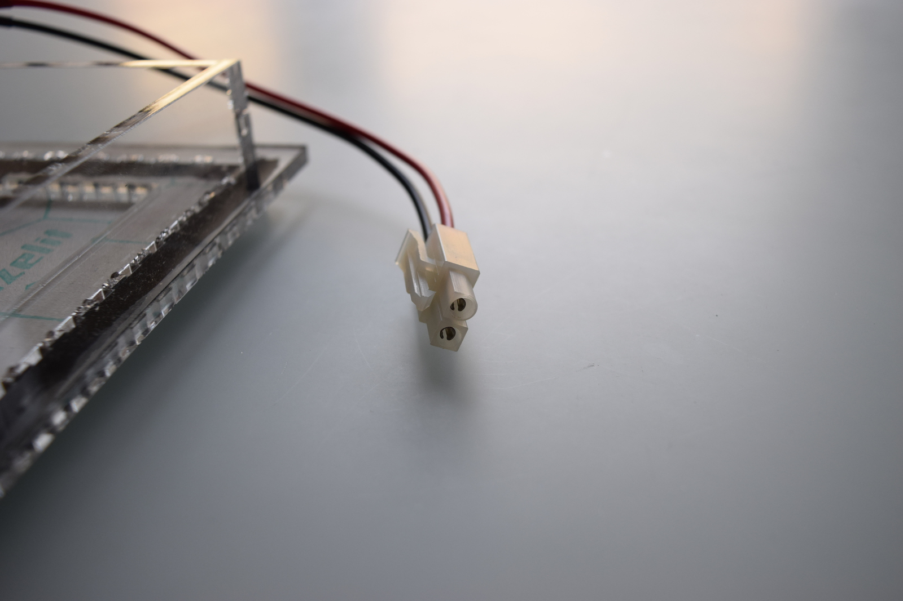
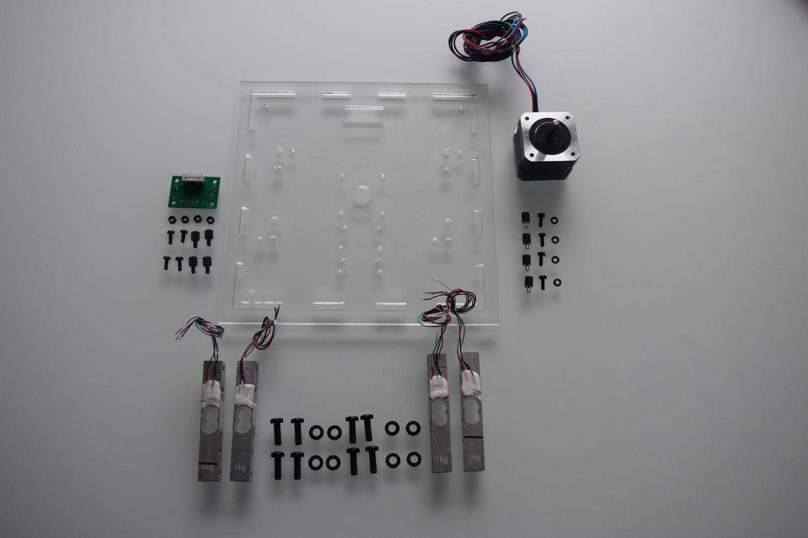
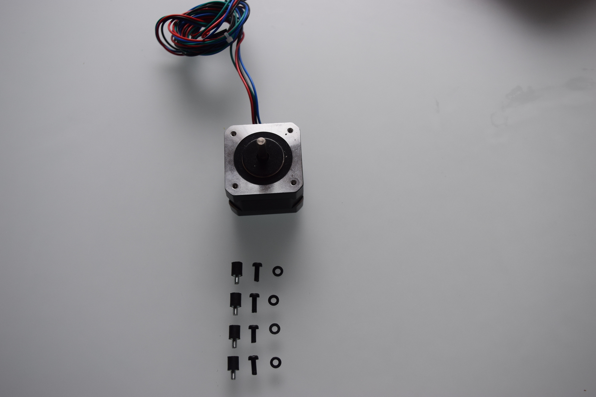
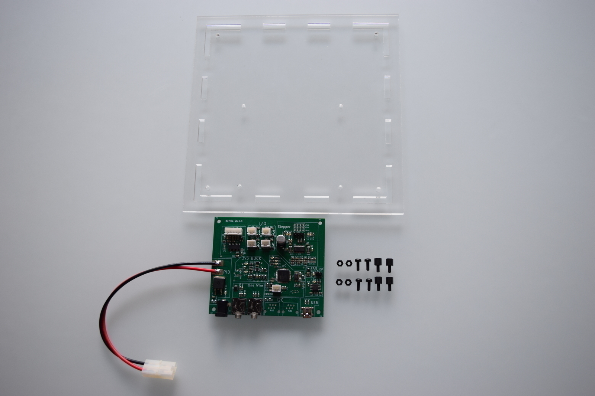
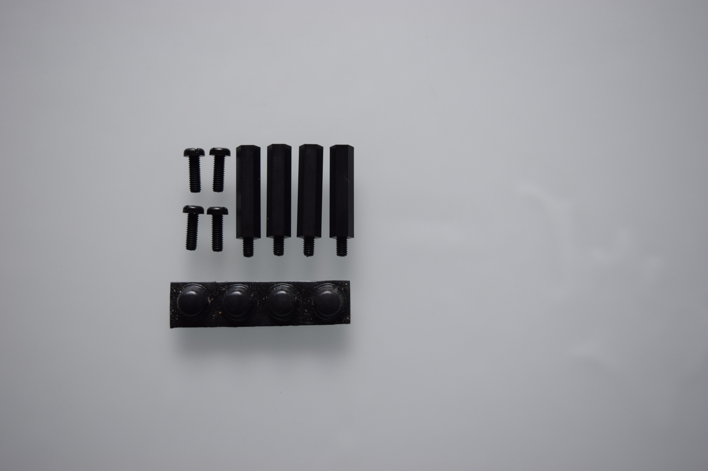
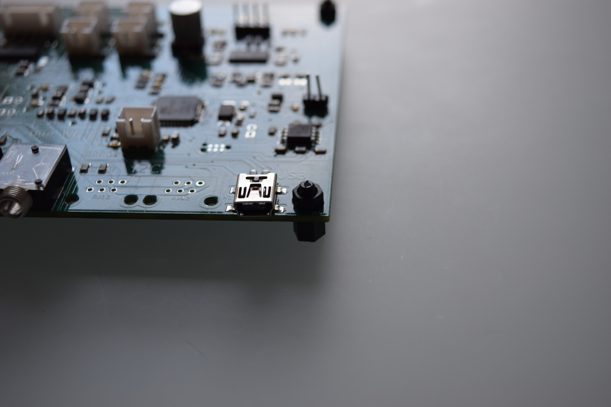
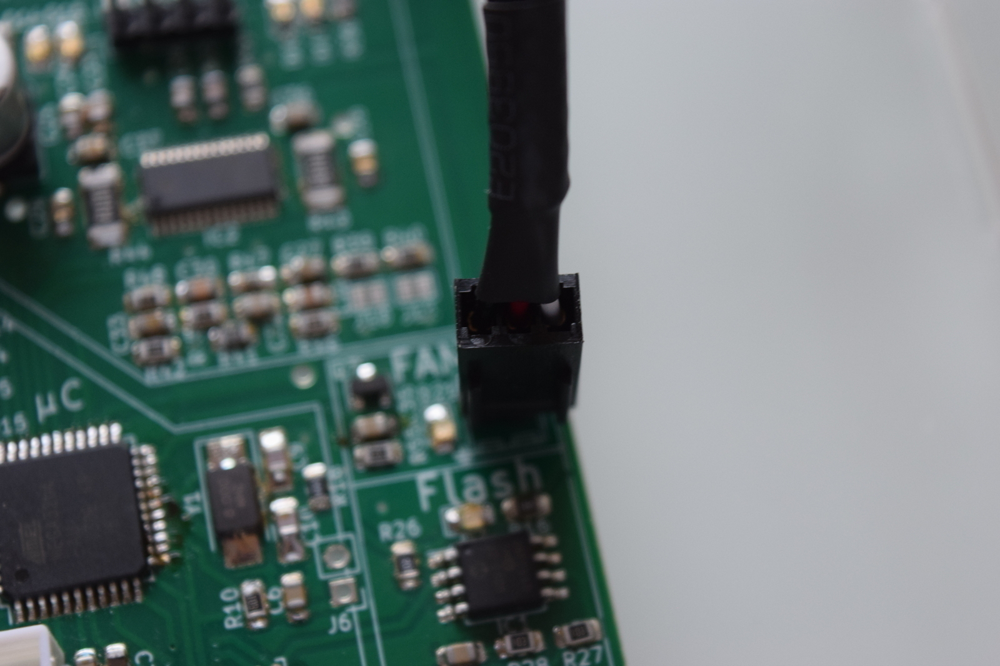
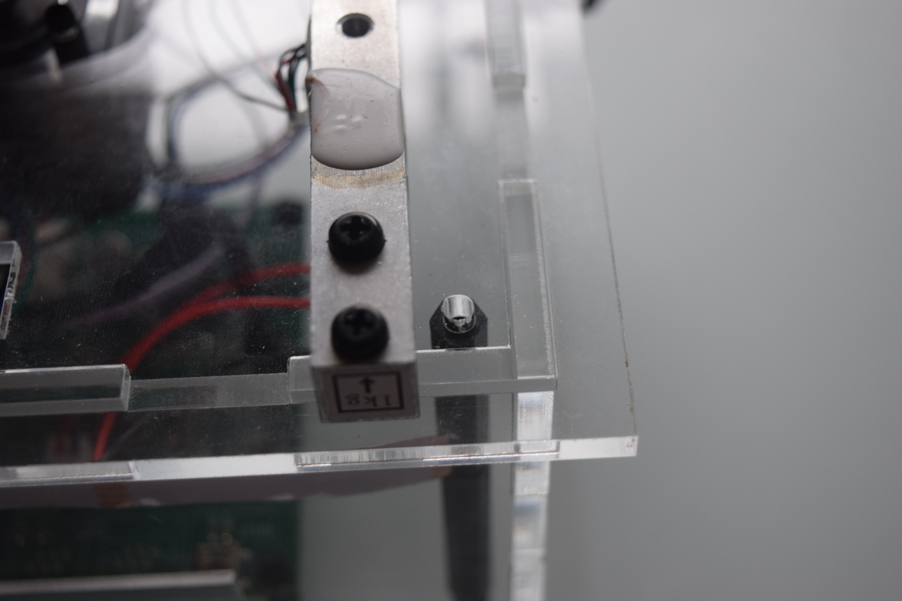

# Components

## Introduction

This manual describes how to assemble a functionnal bioreactor once the PCB plate has been ready and the pieces for the casing have been laser cutted.

The bioreactor is composed of three distinct layers, as can be seen on the following image:

1. **The base:** It is the piece on which the bioreactor stands. It contains the main PCB, as well as the peristaltic pumps and the LCD screen.
2. **The heating plate:** Placed on top of the base, it heats the recipient in which are placed our materials of interest.
3. **The recipient:** It contains the solution in which will be placed our cultures and materials of interest.

## Material required for reactor assembly

**[To be completed]**

For heating plate case:

1. Part `A` of the cases
2. Part `B` of the cases
3. Dichloromethane
4. Heating plate
5. Isolation for heating plate
6. Black silicone
7. 2 pin connector

### General

1. Solder station.
2. Tin.
3. Solder paste.

## Assembling the casing

The first step to assemble the bioreactor is to put the casing together. In this part, we will discuss the base only. Explanation on how to assemble the heating plate will come in a [dedicated section](#readying-the-heating-cell).

First, identify the parts you are dealing with. In the following image are shown all the parts required to build the base.

:::note
Sections `A` and `B` are the base for the heating plate.
:::

:::note
Sections `C` and `D` for the main board.
:::

| A   | DESCRIPTION        |
| :-- | ------------------ |
| 1   | Heating plate base |

| B   | DESCRIPTION |
| :-- | ----------- |
| 1   | Front       |
| 2   | Behind      |
| 3   | Left        |
| 4   | Right       |

| C   | DESCRIPTION |
| :-- | ----------- |
| 1   | Top         |
| 2   | Bottom      |

| D   | DESCRIPTION |
| :-- | ----------- |
| 1   | Right       |
| 2   | Left        |
| 3   | Front       |
| 4   | Behind      |

Tape all parts together **except `Top`** and glue them with _dichloromethane_. Wait about 10 minutes until the solvent has dried out. When assembling, please beware of the following details:

:::caution

- On the `Bottom` part, the 4 small holes designed for the screws that will support the PCB should be on the `Front` when looking from the front of the bioreactor.
- The part containing only one big circular hole for the pump `Right` should be on the right side when looking from the front and the holes should be in the back.
- The part containing the two big circular holes for the pump and fan `Left` should be on the left side when looking from the front and the holes should be in the back.

:::

### Heating plate base

Components:

1. Part `A` of the cases
2. Part `B` of the cases
3. Dichloromethane
4. Heating plate
5. Isolation for heating plate
6. Black silicone
7. 2 pin connector.

Tape all parts together and glue with dochloromethane, in the top of this case you need to paste the isolation and heating plate both like the picture:

For the connector, you need to use a width cable that tolerate more than 4 A, and solder correctly:

:::caution
Be sure that you use the correct connector for the heating plate.
:::

:::tip
Try to avoid any contact between case and heating plate using the silicone.
:::

### Top

Components:

1. Part `C-1`
2. Stepper motor
3. 4 connectors stepper-screws
4. 4 screws
5. 4 packing rings
6. 4 loading cells
7. 8 screws for loading cell
8. 8 packing rings for loading cells
9. 1 PCB for connections between loading cells and bioreactor main PCB
10. 4 connectors PCB-screws.
11. 4 screws for PCB
12. 4 packing rings

#### Loading cells

:::note
To avoid any pressure on load cells, you need to put the packing rings between loading cell and case.
:::

:::caution
Take care! There is only one correct conection between the loading cells and case, if you connect for the incorrect side, you have problems with PCB connection.
:::

:::note
Look the hole positions for every loading cell cable.
:::

#### Loading cell connection board

#### Stepper

#### Agitation

#### Solder Loading cells

## Base case

### Right

### Left

### Front

### Bottom

## Connect all the cases

### Parts C and D

### Parts A, B, C, and D

## Inserting the peristaltic pumps

After finishing the assembly of the base, it is time to start adding the important parts. Take two _peristaltic pumps_ and insert them in the holes made for them in the right wall of the base.
Screw them with 2 _M3x14cm screws_ each as shown on the following picture.

Take two _cables 2 pins KF2510-2P_ and solder them to the pumps as follows:

This completes the assembling of the bases body. We will now work on the bases lid (top part).

## Adding the stepper

First, we will fixate the stepper motor that will control the agitation.

Take the base top part and insert the _stepper motor_ in the middle. Fixate it with four _M3x14mm_ screws. Place four _M4 bolts_ between the lid and the motor to create some space between them.

Take one _cable 6 pins KF2510-6P_ and solder it to the stepper motor as shown in the following pictures:

_The stepper motor and the cable before soldering_

_The stepper motor and the cable after soldering_

_Detail of the connexions between the stepper motor and the cable_

When the cable is properly soldered, place the magnets on the stepper motor as follows:

**[To be completed]**

## Adding the loading cells

Once the stepper motor is properly in place, you will have to place the loading cells.

Take three _loading cells_ and one _cable 5 pins KF2510-5P_.

images/loading-cells1.jpg

Solder the wires of the loading cells to the 5 pins cable as shown in the following picture. The length of the wires from the loading cells to the cable head should be approximately 20cm.

images/loading-cells2.jpg
images/loading-cells2.jpg

Do not solder the black cable from the _KF2510-5P_. Bare it for a couple of centimeters. You should now have all three loading cells attached to each other as follows:

images/loading-cells3.jpg
images/loading-cells3.jpg

On the top part of the base, you will find three big rectangular holes each followed by two small circular ones. In each big hole, pass one loading cell from the bottom of the plate (the magnets from the stepper motor are on the top of the plate).

Screw each loading cell from below the plate with two _M4x14mm_ screws (through the small holes), and on the extremity of the loading cell located above the hole, insert two _M5x14_ screws.

The following drawing sums this up:

It should now look like this (one screw still missing on the picture):

Insert a _plastic screw cover_ on the outest _M5_ screw of each loading cell.

You will now need to connect all loading cells to each other. To do so, cut _two pieces of wire_ of a length of approximately 20cm each and bare both of their ends. Connect the two loading cells on the sides to the central loading cell by wrapping the end of the wires around the central _M5_ screw as shown below. In a similar way, connect the remaining black wire from the _KF2510-5P_ to one of the loading cells on the sides.

_The following drawing shows how the loading cells should be connected to each other:_

Add a bolt on the end of each _M5_ screw to tighten the connexions and keep the cables in place.

This final step completes the assembly of the loading cells. The top part of your bioreactors base should now look like this:

## Preparing the heating cell

**[To be completed]**
