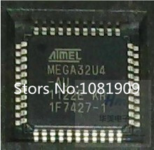
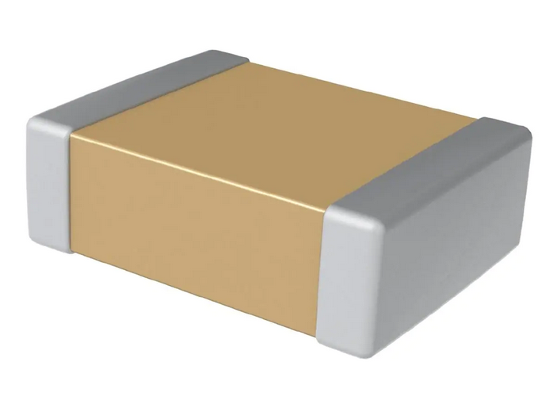

# Bill Of Material (BOM)

[Current stock](https://docs.google.com/spreadsheets/d/1mCMbyp-5vMcfMzT4ovZjpsKi10JSWpNIOFcre1nF27s/edit?usp=sharing)

| Denomination                   | Qty | Unit Price                   | Supplier                                                                                                                                                                                                                                                                                                                                                                                                                                                                                       | Image                                               | Remarks |
| ------------------------------ | --- | ---------------------------- | ---------------------------------------------------------------------------------------------------------------------------------------------------------------------------------------------------------------------------------------------------------------------------------------------------------------------------------------------------------------------------------------------------------------------------------------------------------------------------------------------- | --------------------------------------------------- | ------- |
| 12V 10A power supply 100V-265V | 1   | 17                           | [eBay](http://www.eBay.com/itm/161929667263)                                                                                                                                                                                                                                                                                                                                                                                                                                                   |  |         |
| Magnetic Stirrer bar 5cm       | 1   | 3.6                          | [eBay](http://www.eBay.com/itm/332037093368)                                                                                                                                                                                                                                                                                                                                                                                                                                                   |    |         |
| MK3 heating plate              | 1   | 12.3                         | [Aliexpress](https://es.Aliexpress.com/item/1005003772309144.html?spm=a2g0o.productlist.0.0.40695561hiIpTF&algo_pvid=7abf64d9-14a0-419c-913b-4708faf82849&aem_p4p_detail=20220217121109247507636713570140971466&algo_exp_id=7abf64d9-14a0-419c-913b-4708faf82849-4&pdp_ext_f=%7B%22sku_id%22%3A%2212000027111619894%22%7D&pdp_pi=-1%3B64152.43%3B-1%3B8568498%40salePrice%3BCOP%3Bsearch-mainSearch)                                                                                           |                    |         |
| Plexiglass 600 x 500 x 3 mm    | 1   | 25                           | [Plexiglass.ch](https://roehmschweiz.ch/fr/produits/plaques/plexiglas/xt-allround/incolore-0a000/)                                                                                                                                                                                                                                                                                                                                                                                             |     |
| Pirex Glass Beaker +  flank    | 1   | 50 (Need to check price !!!) | [eBay](https://www.eBay.com/sch/i.html?_from=R40&_trksid=p2334524.m570.l1313&_nkw=beaker+glass+1000ml+duran&_sacat=0&LH_TitleDesc=0&loc=1003668&sitelnk=&poi=&cmpgn=644328398&rlsatarget=dsa-19959388920&geo_id=&network=g&gclid=CjwKCAjwu5yYBhAjEiwAKXk_eL5_t176_oee9seFcVLpZwvMq04NcQjX2FUVvLz7FaaKAXkjviIv_RoCmFoQAvD_BwE&mkcid=2&_odkw=beaker+glass+1000ml&norover=1&MT_ID=&adpos=&adgroupid=29412698887&matchtype=&abcId=&keyword=&mkrid=21553-225709-2056-0&crlp=436738225652_&device=c) |   |
| PCB                            | 1   | 5                            | [PCBWay](https://www.pcbway.com)                                                                                                                                                                                                                                                                                                                                                                                                                                                              |                               |
| Miscellaneous small material   | 1   | 5                            |

## Microcontroller

| Denomination          | Qty | Unit Price | Supplier                                                                                                                          | Image                                                 | Remarks |
| --------------------- | --- | ---------- | --------------------------------------------------------------------------------------------------------------------------------- | ----------------------------------------------------- | ------- |
| Atmega32U4 44TQFP     | 1   | 3.6        | [Mouser](https://www.Mouser.com/ProductDetail/Microchip-Technology-Atmel/ATMEGA32U4RC-AU?qs=7AReRZHh%2FSt%252BRqfzkW8%2FkA%3D%3D) |  |         |
| Capacitor 1 uF 0805   | 1   | 0.16       | [Mouser](https://www.Mouser.com/ProductDetail/Kyocera-AVX/08055C104KAT2A?qs=2ujN4bDBNE9mJvapP%252BjopA%3D%3D)                     |                      |         |
| Capacitor 100 nF 0805 | 3   | 0.16       | [Mouser](https://www.Mouser.com/ProductDetail/Kyocera-AVX/08055C104KAT2A?qs=2ujN4bDBNE9mJvapP%252BjopA%3D%3D)                     |                    |         |
| Capacitor 18 pF 0805  | 2   | 0.16       | [Mouser](https://www.Mouser.com/ProductDetail/KEMET/C0805C180K5HACTU?qs=W0yvOO0ixfF9BHX%2Fb%2Fp2DA%3D%3D)                         |                     |         |
| Crystal 8MHz 5032     | 1   | 0.78       | [Mouser](https://www.Mouser.com/ProductDetail/ECS/ECS-080-18-23G-JGN-TR?qs=HXFqYaX1Q2w96I4MjMnYbA%3D%3D)                          |              |
| Resistor 1M 0805      | 1   | 0.1        | [Mouser](https://www.Mouser.com/ProductDetail/Vishay-Dale/CRCW08051M00FKEAC?qs=sGAEpiMZZMtlubZbdhIBIIZe04wfiaJWumBK5p1HGl0%3D)    |                |
| Resistor 10k 0805     | 2   | 0.1        | [Mouser](https://www.Mouser.com/ProductDetail/KOA-Speer/RK73H2ATTD1002F?qs=sGAEpiMZZMtlubZbdhIBIADEshVnklemK%252BhrLNEuMe8%3D)    |     |

## Power

| Denomination                            | Qty | Unit Price | Supplier                                                                                                                                                                                                                                                                                                                                                                                                                 | Image                                              | Remarks |
| --------------------------------------- | --- | ---------- | ------------------------------------------------------------------------------------------------------------------------------------------------------------------------------------------------------------------------------------------------------------------------------------------------------------------------------------------------------------------------------------------------------------------------ | -------------------------------------------------- | ------- |
| Led Red 0805                            | 2   | 0.19       | [Mouser](https://www.Mouser.com/ProductDetail/Wurth-Elektronik/150080SS75000?qs=LlUlMxKIyB2zzpiaOzrUdw%3D%3D)                                                                                                                                                                                                                                                                                                            |                          |         |
| Resistor 1k 0805                        | 1   | 0.1        | [Mouser](https://www.Mouser.com/ProductDetail/Vishay-Dale/CRCW08051K00JNEAC?qs=sGAEpiMZZMtlubZbdhIBIIZe04wfiaJWy7nwcSDiXks%3D)                                                                                                                                                                                                                                                                                           |             |
| Resistor 10k 0805                       | 1   | 0.1        | [Mouser](https://www.Mouser.com/ProductDetail/KOA-Speer/RK73H2ATTD1002F?qs=sGAEpiMZZMtlubZbdhIBIADEshVnklemK%252BhrLNEuMe8%3D)                                                                                                                                                                                                                                                                                           |  |
| Power socket DC 5.5x2.5                 | 1   | 0.1        | [Aliexpress](https://fr.Aliexpress.com/item/4001045513477.html?spm=a2g0o.productlist.0.0.41181da2CG7A8N&algo_pvid=83917996-076c-475b-884b-0d8abed0c348&algo_exp_id=83917996-076c-475b-884b-0d8abed0c348-31&pdp_ext_f=%7B%22sku_id%22%3A%2210000013724351727%22%7D&pdp_npi=2%40dis%21COP%213601.38%213196.23%21%21%211755.67%21%21%402103250d16614608763396155e1963%2110000013724351727%21sea&curPageLogUid=Sex1SPHohTwp) |    |
| Capacitor 100 nF 0805                   | 2   | 0.16       | [Mouser](https://www.Mouser.com/ProductDetail/Kyocera-AVX/08055C104KAT2A?qs=2ujN4bDBNE9mJvapP%252BjopA%3D%3D)                                                                                                                                                                                                                                                                                                            |                 |         |
| Capacitor 10 uF 0805                    | 4   | 0.11       | [Mouser](https://www.Mouser.com/ProductDetail/Samsung-Electro-Mechanics/CL21A106KOQNNNG?qs=hqM3L16%252BxlcMWI7QbqH0LA%3D%3D)                                                                                                                                                                                                                                                                                             |                  |
| Schottky MBR0520LT1G SOD-123            | 3   | 0.38       | [Mouser](https://www.Mouser.com/ProductDetail/onsemi/MBR0520LT1G?qs=3JMERSakebqBWTiPUQp0nw%3D%3D)                                                                                                                                                                                                                                                                                                                        |                  |
| ACT4088 3.3 V buck converter - SOD-23-6 | 1   | 0.03       | [Mouser](https://www.Mouser.com/ProductDetail/Qorvo/ACT4088US-T?qs=%2Fha2pyFaduj3zC6esU%2F8%252BfzWZ4716qD%252Byca2A%252BeLaTI%3D)                                                                                                                                                                                                                                                                                       |                     |

## Communication

| Denomination                | Qty | Unit Price | Supplier                                                                                                                                                                                                                                                                                                                                                                                                                                                                                                                                      | Image                                              | Remarks |
| --------------------------- | --- | ---------- | --------------------------------------------------------------------------------------------------------------------------------------------------------------------------------------------------------------------------------------------------------------------------------------------------------------------------------------------------------------------------------------------------------------------------------------------------------------------------------------------------------------------------------------------- | -------------------------------------------------- | ------- |
| Led Green 0805              | 2   | 0.19       | [Mouser](https://www.Mouser.com/ProductDetail/Wurth-Elektronik/150080GS75000?qs=2kOmHSv6VfQRoTEZVk1mGA%3D%3D)                                                                                                                                                                                                                                                                                                                                                                                                                                 |                        |         |
| Led Yellow 0805             | 2   | 0.19       | [Mouser](https://www.Mouser.com/ProductDetail/Wurth-Elektronik/150080YS75000?qs=LlUlMxKIyB3k0fZGrDMI2w%3D%3D)                                                                                                                                                                                                                                                                                                                                                                                                                                 |                       |         |
| Led Blue 0805 (blink)       | 1   | 0.19       | [Mouser](https://www.Mouser.com/ProductDetail/Wurth-Elektronik/150080BS75000?qs=2kOmHSv6VfT2tBo3UPVqAQ%3D%3D)                                                                                                                                                                                                                                                                                                                                                                                                                                 |                         |
| Resistor 1k 0805            | 5   | 0.1        | [Mouser](https://www.Mouser.com/ProductDetail/Vishay-Dale/CRCW08051K00JNEAC?qs=sGAEpiMZZMtlubZbdhIBIIZe04wfiaJWy7nwcSDiXks%3D)                                                                                                                                                                                                                                                                                                                                                                                                                |             |
| Resistor 10k 0805           | 3   | 0.1        | [Mouser](https://www.Mouser.com/ProductDetail/KOA-Speer/RK73H2ATTD1002F?qs=sGAEpiMZZMtlubZbdhIBIADEshVnklemK%252BhrLNEuMe8%3D)                                                                                                                                                                                                                                                                                                                                                                                                                |  |
| FPC 8-pin 1mm AWM 20624     | 1   | 0.16       | [Aliexpress](https://www.Aliexpress.com/snapshot/7326978877.html?orderId=72887395416335&productId=32468149160)                                                                                                                                                                                                                                                                                                                                                                                                                                |
| RJ-11 connector 6P6C (RJ12) | 2   | 0.1        | [Aliexpress](https://www.Aliexpress.com/item/100PCS-RJ11-socket-Gray-RJ11-telephone-90-degrees-6pin-crystal-female-6p6c-socket/32778483833.html?spm=2114.30010308.3.19.zamS8u&ws_ab_test=searchweb0_0,searchweb201602_3_10065_10068_10000009_10084_10083_10080_10082_10081_10060_10062_10056_10055_10037_10054_10059_10032_10099_10078_10079_10077_10000012_426_10103_10073_10102_10000015_10096_10052_10053_10107_10050_10106_10051,searchweb201603_1,afswitch_3_afChannel,single_sort_0_default&btsid=7dc23b32-807b-416b-9b43-88c36e40e12c) |                          |

## One wire & PID

| Denomination                   | Qty | Unit Price | Supplier                                                                                                                                                                                                                                                                                                                                                                                                         |
| ------------------------------ | --- | ---------- | ---------------------------------------------------------------------------------------------------------------------------------------------------------------------------------------------------------------------------------------------------------------------------------------------------------------------------------------------------------------------------------------------------------------- | --------------------------------------------------- | --- |
| DS18B20Z One wire MSOP8        | 1   | 1.0        | [Aliexpress](https://fr.Aliexpress.com/item/1005001682442901.html?spm=a2g0o.productlist.0.0.e7da2be7kMJsZQ&algo_pvid=336b7769-4d95-4488-96d5-7962593fac24&algo_exp_id=336b7769-4d95-4488-96d5-7962593fac24-3&pdp_ext_f=%7B%22sku_id%22%3A%2212000017116589112%22%7D&pdp_npi=2%40dis%21USD%2111.74%219.98%21%21%21%21%21%402101e9d016614729369843734eb59d%2112000017116589112%21sea&curPageLogUid=xScymU1gXVBS)   |          |     |
| DS18B20 temperature with cable | 1   | 1.33       | [Aliexpress](https://fr.Aliexpress.com/item/1005002567036067.html?spm=a2g0o.productlist.0.0.371668d8hZpSF3&algo_pvid=0ba17b96-f7bc-4d75-92ad-bbd05be0eff4&algo_exp_id=0ba17b96-f7bc-4d75-92ad-bbd05be0eff4-15&pdp_ext_f=%7B%22sku_id%22%3A%2212000021179382903%22%7D&pdp_npi=2%40dis%21USD%210.63%210.6%21%21%21%21%21%402101e9d016614731762867230eb59d%2112000021179382903%21sea&curPageLogUid=8YQgBUXLyc07)    |              |     |
| IPB80N03S4L-03 - D2 pack       | 1   | 2.14       | [Mouser](https://www.Mouser.com/ProductDetail/Infineon-Technologies/IPB80N03S4L-03?qs=9Vqdt%252BdHmfJ57UE%252BtEYJhg%3D%3D)                                                                                                                                                                                                                                                                                      |   |     |
| Led Red 0805                   | 1   | 0.19       | [Mouser](https://www.Mouser.com/ProductDetail/Wurth-Elektronik/150080SS75000?qs=LlUlMxKIyB2zzpiaOzrUdw%3D%3D)                                                                                                                                                                                                                                                                                                    |                           |     |
| Resistor 1k 0805               | 4   | 0.1        | [Mouser](https://www.Mouser.com/ProductDetail/Vishay-Dale/CRCW08051K00JNEAC?qs=sGAEpiMZZMtlubZbdhIBIIZe04wfiaJWy7nwcSDiXks%3D)                                                                                                                                                                                                                                                                                   |              |
| Resistor 4.7k 0805             | 2   | 0.1        | [Mouser](https://www.mouser.com/ProductDetail/KOA-Speer/RK73H2ATTD4701F?qs=sGAEpiMZZMtlubZbdhIBIDy5tslNVG7gwbfvlR%2FSa3E%3D)                                                                                                                                                                                                                                                                                     |  |
| 3.5 mm male plug               | 1   | 0.26       | [Aliexpress](https://fr.aliexpress.com/item/1005004557012333.html?spm=a2g0o.productlist.0.0.242d2fa2nQx0LU&algo_pvid=a476dc77-f7d9-4c20-ae54-4bc0b3625b47&algo_exp_id=a476dc77-f7d9-4c20-ae54-4bc0b3625b47-17&pdp_ext_f=%7B%22sku_id%22%3A%2212000029601886280%22%7D&pdp_npi=2%40dis%21USD%212.4%211.2%21%21%210.14%21%21%402103250d16614742181227064e195e%2112000029601886280%21sea&curPageLogUid=fApAjdobwjIX) |        |     |
| 3.5 Female jack PCB PF3024M    | 1   | 0.17       | [Aliexpress](https://fr.aliexpress.com/item/33004214640.html?spm=a2g0o.productlist.0.0.242d2fa2nQx0LU&algo_pvid=aa2b201a-462d-45be-b956-3114b09e3052&algo_exp_id=aa2b201a-462d-45be-b956-3114b09e3052-15&pdp_ext_f=%7B%22sku_id%22%3A%2267087976597%22%7D&pdp_npi=2%40dis%21USD%211.34%210.94%21%21%210.83%21%21%402103250d16614742628448986e195e%2167087976597%21sea&curPageLogUid=cOSzcAB88gnA)                |    |     |

## USB

| Denomination           | Qty | Unit Price | Supplier                                                                                                                                             | Image | Remarks |
| ---------------------- | --- | ---------- | ---------------------------------------------------------------------------------------------------------------------------------------------------- | ----- | ------- |
| Resistor 22 ohms 0805  | 2   | 0.12       | [Mouser](https://www.mouser.com/ProductDetail/Vishay-Dale/CRCW080522R0FKEAC?qs=sGAEpiMZZMtlubZbdhIBIIZe04wfiaJWetFEtFS3dhw%3D)                                                                                                                                                     | 
| USB mini PCB connector | 1   | 0.06       | [Aliexpress](https://fr.aliexpress.com/item/1005003672082538.html?spm=a2g0o.productlist.0.0.370c5299CRSAxW&algo_pvid=e7a03da4-d85a-47f6-86ff-6e0b203a9242&algo_exp_id=e7a03da4-d85a-47f6-86ff-6e0b203a9242-6&pdp_ext_f=%7B%22sku_id%22%3A%2212000026740979619%22%7D&pdp_npi=2%40dis%21USD%210.17%210.17%21%21%210.48%21%21%402103255a16614747956195626e02e7%2112000026740979619%21sea&curPageLogUid=DtkilyzvU6Ij) | 
| Capacitor 10 uF 0805   | 1   | 0.11       | [Mouser](https://www.mouser.com/ProductDetail/Samsung-Electro-Mechanics/CL21A106KOQNNNG?qs=hqM3L16%252BxlcMWI7QbqH0LA%3D%3D)                                                                                                                                                      | 

## Food

| Denomination            | Qty | Unit Price | Supplier                                                                                                                                                                                                                                                                                                                                                                                                                                                                                                    | Image                                                       | Remarks |
| ----------------------- | --- | ---------- | ----------------------------------------------------------------------------------------------------------------------------------------------------------------------------------------------------------------------------------------------------------------------------------------------------------------------------------------------------------------------------------------------------------------------------------------------------------------------------------------------------------- | ----------------------------------------------------------- | ------- |
| Resistor 1k 0805        | 2   | 0.1        | [Mouser](https://www.Mouser.com/ProductDetail/Vishay-Dale/CRCW08051K00JNEAC?qs=sGAEpiMZZMtlubZbdhIBIIZe04wfiaJWy7nwcSDiXks%3D)                                                                                                                                                                                                                                                                                                                                                                              |                      |
| Resistor 10k 0805       | 2   | 0.01       | [Mouser](https://www.Mouser.com/ProductDetail/KOA-Speer/RK73H2ATTD1002F?qs=sGAEpiMZZMtlubZbdhIBIADEshVnklemK%252BhrLNEuMe8%3D)                                                                                                                                                                                                                                                                                                                                                                              |           |
| Led Red 0805            | 2   | 0.19       | [Mouser](https://www.Mouser.com/ProductDetail/Wurth-Elektronik/150080SS75000?qs=LlUlMxKIyB2zzpiaOzrUdw%3D%3D)                                                                                                                                                                                                                                                                                                                                                                                               |                                   |         |
| BSP75 SOT223            | 2   | 0.3        | [Aliexpress](https://www.Aliexpress.com/item/Free-shipping-50pcs-lot-BSP75-BSP76-BSP77-SOT223/2026904236.html?spm=2114.30010308.3.10.m2zlgV&ws_ab_test=searchweb0_0,searchweb201602_3_10065_10068_10000009_10084_10083_10080_10082_10081_10060_10062_10056_10055_10037_10054_10059_10032_10099_10078_10079_10077_10000012_426_10103_10073_10102_10000015_10096_10052_10053_10107_10050_10106_10051,searchweb201603_1,afswitch_3_afChannel,single_sort_0_default&btsid=413c08f9-9370-41e8-b673-9b6507cf92a5) |                                                             |         |
| Header 2 pins KF2510-2P | 2   | 0.1        | [eBay](http://www.eBay.com/itm/251255708763)                                                                                                                                                                                                                                                                                                                                                                                                                                                                |  |         |
| Cable 2 pins KF2510-2P  | 2   | 0.5        | eBay                                                                                                                                                                                                                                                                                                                                                                                                                                                                                                        |                                                             |         |
| Peristaltic pumps       | 2   | 7          | [eBay](http://www.eBay.com/itm/201749015545?_trksid=p2057872.m2749.l2649&ssPageName=STRK%3AMEBIDX%3AIT)                                                                                                                                                                                                                                                                                                                                                                                                     |                                                             |         |

## Weight

| Denomination                | Qty | Unit Price | Supplier                                                                                                                                                           |
| --------------------------- | --- | ---------- | ------------------------------------------------------------------------------------------------------------------------------------------------------------------ | -------------------------------------------------- | --- |
| HX711 SOP16                 | 1   | 0.5        | [eBay](http://www.eBay.com/itm/182316289786)                                                                                                                       |   |     |
| Load cell 2kg YZC-133       | 3   | 2.7        | [Aliexpress](https://www.Aliexpress.com/item/Electronic-2KG-YZC-133-Aluminum-Weighing-Weight-Scale-Sensor-Load-Cell/32660749913.html?spm=2114.13010608.0.0.vVBDFq) |         |
| Resistor 100 0805           | 2   | 0.01       |                                                                                                                                                                    |
| Resistor 8.2k 0805          | 1   | 0.01       |                                                                                                                                                                    |
| Resistor 10k 0805           | 1   | 0.1        | [Mouser](https://www.Mouser.com/ProductDetail/KOA-Speer/RK73H2ATTD1002F?qs=sGAEpiMZZMtlubZbdhIBIADEshVnklemK%252BhrLNEuMe8%3D)                                     |  |
| Resistor 20k 0805           | 1   | 0.01       |                                                                                                                                                                    |
| Capacitor 100 nF 0805       | 4   | 0.01       |                                                                                                                                                                    |
| Capacitor 10 uF 0805        | 2   | 0.01       |                                                                                                                                                                    |
| Transistor MMBT4403 SOT23-3 | 1   | 0.03       | [eBay](http://www.eBay.com/itm/100-PCS-MMBT4403-SOT-23-2N4403-SMD-PNP-transistor-/371086000069?hash=item566672ffc5:g:Gg8AAOSwBvNTouQY)                             |
| Header 5 pins KF2510-5P     | 1   | 0.2        |                                                                                                                                                                    |                                                    |     |
| Cable 5 pins KF2510-5P      | 1   | 0.6        |                                                                                                                                                                    |                                                    |     |

## Stepper

| Denomination                               | Qty | Unit Price | Supplier                                                                                                                                                                        |
| ------------------------------------------ | --- | ---------- | ------------------------------------------------------------------------------------------------------------------------------------------------------------------------------- | ----------------------------------------- | --- |
| Header 4 pins KF2510-4P                    | 1   | 0.3        |                                                                                                                                                                                 |
| Cable 4 pins KF2510-4P                     | 1   | 0.7        |                                                                                                                                                                                 |
| DRV8811 Motor driver                       | 1   | 1          |                                                                                                                                                                                 |
| Resistor 47k 0805                          | 2   | 0.01       |                                                                                                                                                                                 |
| Resistor 4.7k 0805                         | 1   | 0.01       |                                                                                                                                                                                 |
| Resistor 3.3k 0805                         | 1   | 0.01       |                                                                                                                                                                                 |
| Resistor 680 0805                          | 1   | 0.01       |                                                                                                                                                                                 |
| Resistor 10k 0805                          | 9   | 0.01       |                                                                                                                                                                                 |
| Resistor 0.2 1W 2010                       | 2   | 0.6        |                                                                                                                                                                                 |
| Capacitor 220 nF 0805                      | 3   | 0.01       |                                                                                                                                                                                 |
| Capacitor 100 nF 0805                      | 6   | 0.01       |                                                                                                                                                                                 |
| Capacitor 1 nF 0805                        | 2   | 0.01       |                                                                                                                                                                                 |
| Polarized capacitor 100 uF 50V PANASONIC_E | 1   | 0.8        |                                                                                                                                                                                 |
| Led Red 0805                               | 4   | 0.19       |                                                                                                                                                                                 |
| Nema 17 Unipolar Stepper 12v               | 1   | 15         | [stepperonline](http://www.omc-stepperonline.com/nema-17-unipolar-stepper-031a-158ncm224ozin-17hs130316s-p-65.html)                                                             |  |     |
| Round magnet 20 x 5mm                      | 2   | 0.75       | [eBay](http://www.eBay.com/itm/20Pcs-N50-Super-Strong-Disc-Cylinder-Round-Magnets-20x5mm-Rare-Earth-Neodymium-/371778047624?var=&hash=item568fb2ce88:m:mIjauxTTiDkmOyNvGzp6vmw) |    |

## Memory

| Denomination          | Qty | Unit Price | Supplier                                                                                                                                            |
| --------------------- | --- | ---------- | --------------------------------------------------------------------------------------------------------------------------------------------------- | ------------------------------------------------- | --- |
| SST26VF064B-104I/SM   | 1   | 2.0        | [Aliexpress](https://www.Aliexpress.com/item/SST26VF064B-I-SM-SST26VF064B-I-SST26VF064B-new-original/32760981168.html?spm=2114.13010608.0.0.vhdFdY) |  |     |
| Resistor 10k 0805     | 2   | 0.01       |                                                                                                                                                     |
| Resistor 1k 0805      | 1   | 0.01       |                                                                                                                                                     |
| Capacitor 100 nF 0805 | 1   | 0.01       |                                                                                                                                                     |

## LCD

| Denomination                 | Qty | Unit Price | Supplier                                                                                                                                                                             | Image                                                 | Remarks |
| ---------------------------- | --- | ---------- | ------------------------------------------------------------------------------------------------------------------------------------------------------------------------------------ | ----------------------------------------------------- | ------- |
| Atmega32U4 44TQFP            | 1   | 3.6        | [Aliexpress](https://www.Aliexpress.com/item/10pcs-lot-ATMEGA32U4-AU-ATMEGA32U4-TQFP-44-IC-8-bit-Microcontroller-with-16-32K-Bytes-of/32720185776.html?spm=2114.13010608.0.0.Brw1qI) |  |         |
| Capacitor 100 nF 0805        | 5   | 0.01       |                                                                                                                                                                                      |
| Capacitor 10 uF 0805         | 4   | 0.01       |                                                                                                                                                                                      |
| Capacitor 22 pF 0805         | 2   | 0.02       |                                                                                                                                                                                      |
| Crystal 16MHz 5032           | 1   | 0.25       |                                                                                                                                                                                      |
| Resistor 1M 0805             | 1   | 0.01       |                                                                                                                                                                                      |
| Resistor 10k 0805            | 4   | 0.01       |                                                                                                                                                                                      |
| Resistor 22 0805             | 2   | 0.01       |                                                                                                                                                                                      |
| Resistor 1k 0805             | 4   | 0.01       |                                                                                                                                                                                      |
| NCP1117LPST50T3G             | 1   | 0.6        |                                                                                                                                                                                      |
| Schottky 1N581 1206          | 2   | 0.03       | [eBay](http://www.eBay.com/itm/121381924838?_trksid=p2060353.m2749.l2649&ssPageName=STRK%3AMEBIDX%3AIT)                                                                              |
| USB mini PCB connector       | 1   | 0.05       | [eBay](http://www.eBay.com/itm/20-Pcs-Replacement-USB-Mini-5-Pin-Female-SMT-PCB-Mount-Jacks-LW-/171817138823?hash=item2801197a87:g:KUgAAOSwEgVWT4m-)                                 |
| FPC 8-pin 1mm AWM 20624      | 3   | 0.16       | [Aliexpress](https://www.Aliexpress.com/snapshot/7326978877.html?orderId=72887395416335&productId=32468149160)                                                                       |
| 12mm Rotary Encoder w switch | 1   | 0.5        | [Aliexpress](https://www.Aliexpress.com/snapshot/7321568543.html?spm=2114.13010608.0.0.WuBkow&orderId=72780181866335&productId=32346748762)                                          |
| LCD 20x4 HD44780 5v          | 1   | 4          | [eBay](http://www.eBay.com/itm/2004-204-20x4-Character-LCD-Display-Module-HD44780-Controller-Blue-Blacklight-/381374605432?hash=item58cbb2a878:g:urwAAOSwj0NUjt4w)                   |
| Flat cable 8-pin 1mm 20cm    | 2   | 0.3        |                                                                                                                                                                                      |
