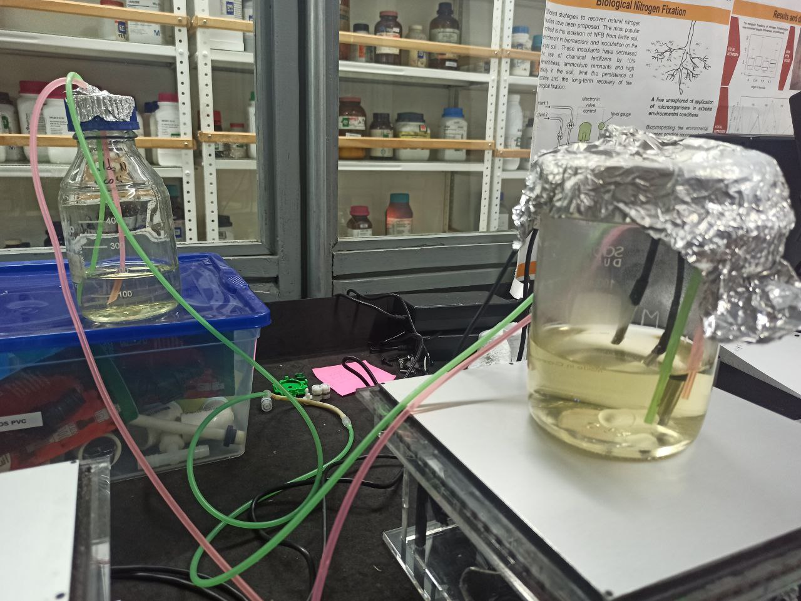

# Applications in biology

## Escherichia coli

<!-- Optical density (OD) at 600nm is often used in biology to determine
biomass increase versus time. In this experiment we have placed
Escherichia coli with cell growing media directly in the spectrophotometer
cell and placed the spectrophotometer itself on a shaker in the incubator.
We can then program it to measure the absorbance every X seconds. In our case
we measured it every 30 minutes (up to 40 measures). The following curve was obtained.

This experiment clearly shows the log phase and the stationary phase. But
the growth was faster than expected. An acquisition every 15 minutes
would have been a better choice. -->

### Running [Example 3](../../30_using/20_steps.md#example-3)

- Beginning:

- After 18 hours under test:

