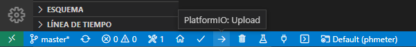
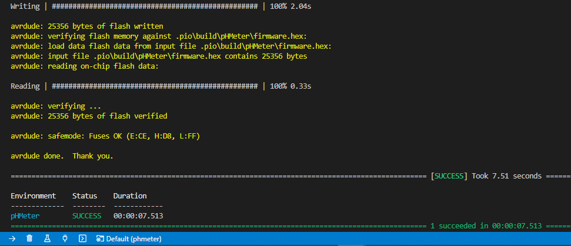

# Installation

## Cloning the project

### Requirements

1. Git (^2.25.1)
2. Visual Studio Code (^1.61.2)

You know with age we take some habits and it would be easier if you follow the same ones...

All our GitHub projects are always in a folder called `git`
which is at the first level of the `home` directory. It is followed by the
name of the GitHub user/organization and finally the project name.

So, go to the project from bash:

```bash
cd ~/git/hackuarium/phmeter
```

:::info
The possibility to clone the project will require that you validate your public key in GitHub!
:::

## Installing the PlatformIO plugin

In VSCode you need to open `Extensions` tab or press <kbd>CTRL</kbd> + <kbd>Shift</kbd> + <kbd>x</kbd>, and search ´PlatformIO IDE´ to install it:


## Hardware support for Leonardo 8MHz = LilyPad Arduino USB

The pHMeter is operating at 8MHz/3V3 instead of the standard 16MHz/5V.

:::warning
If you do any mistake and try flashing the pHMeter board as if it was a normal Leonardo, you will be able to flash the program but the USB port will not be recognized anymore afterwards. You will have to reflash the bootloader!!!
:::

:::caution

In case that you need to burn the firmware for the pHMeter from factory, you must to use the Lilypad Arduino USB bootloader like first step before upload the code. (Go to [Burning bootloader](#burning-bootloader) section for solve it).

:::

## Using USBtiny

By default some Linux versions will only give you a USB readonly access and will prevent you from burning the bootloader.

In order for the USBTiny to have r/w access you should add a USB rule:

```bash
# UDEV rule for Arduino ISP R3 programmer board,
# to prevent having to run Arduino IDE as root to get it to program.
# Copy this file to /etc/udev/rules.d so

SUBSYSTEMS=="usb", ATTRS{idVendor}=="1781", ATTRS{idProduct}=="0c9f", GROUP="plugdev", MODE="0666"
```

## That's it

You should now be able to compile the project from PlatformIO IDE.

### Burning bootloader

import { VscTerminal, VscArrowRight } from "react-icons/vsc";

You can now proceed with burning the bootloader using the `program_via_USBtinyISP` environment created in `platformio.ini` file. Click on `PlatformIO: New Terminal` <VscTerminal /> and type:

```bash
> pio run -e program_via_USBtinyISP --target bootloader
```


### Upload the code

Once you have the bootloader, you can upload your code with `PlatformIO: Upload` <VscArrowRight /> or press <kbd>Ctrl</kbd> + <kbd>Alt</kbd> + <kbd>U</kbd>:



You can check upload success in the same terminal:



## The parameters

In order to control the bioreactor you should have a look at the description of the [Parameters](20_parameters.md) (Go Next).
