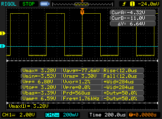
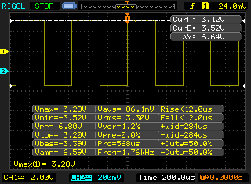

# EC

For the EC reading, we are checking all the hardware steps to be sure that the signal pass correctly.

## Signal generator

This first test is in the outoput pin for the signal generator, you must to put the oscilloscope probe in the pin 7 for U8 IC like the next picture:

If everything runs well, you have to obtain a signal plot like this:

The corrects values for this part of the circuit need to be:

| Measurement | Value |
| :---------- | ----- |
| Voltage Max | $$\approx 3.3 V$$ |

