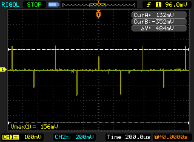
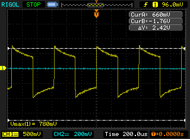

# EC

For the EC reading, we are checking all the hardware steps to be sure that the signal pass correctly.

## Signal generator

This first test is in the outoput pin for the signal generator, you must to put the oscilloscope probe in the pin 7 for U8 IC like the next picture:

If everything runs well, you have to obtain a signal plot like this:

The ideal values for this part of the circuit need to be:

| Measurement | Value    |
| :---------- | -------- |
| Voltage Max | 3.3 V    |
| Voltage Min | -3.3 V   |
| Frequency   | 1.76 kHz |

The experimental results are very similiar to the plot 1 in the figure:

### Excitation signal

Once you have a correct signal generation, the next step is check if you have the correct reduction voltage to supply the EC probe. So, you need to check the center pin for the BNC connector in the EC circuit.

Now, you must obtain this results:

| Measurement | Value    |
| :---------- | -------- |
| Voltage Max | 129 mV   |
| Voltage Min | -129 mV  |
| Frequency   | 1.76 kHz |

You can see plot 2 signal result in this figure:

:::info

You can see the differnce between the magnitude of the voltage between the signal square generation and excitation in this figure:

1. Considering the difference between the gain in each channel. **Channel 1** has 2.00 V for every square in the horizontal axis (white dots behind yellow and blue plots), while **Channel 2** has 200 mV instead.
2. Due to design for OPA (negative feedback), the excitation signal has the negative part for the signal generation, but this doesn't have any important consequence later.

:::

## Adquiring EC signal

The principal measurement in this case was made using KCI (potassium chloride) mixed with destilated water in proportion 1:1 for 50 ml. In this case, you need to read in 1 of the 4 external pins in the BNC connector for EC (see Figure).

The response in the oscilloscope must to be similar to this:

You can see the big difference compare to the excitation. Now, you have volage peaks with the same frequency to the signal excitation not square signal. This is due to the fast exponential behavior in the transfer of ions from the solution. In the same way, in the later stages of the conditioning circuit, a change in the signal will be obtained, so that it's easily interpreted by the ADC.

:::info
Compare the excitation signal (**Channel 2**) versus signal response (**Channel 1**):

:::

### First stage of conditioning

After check the correct response for the EC probe, you need to check the diode + OPA configuration.

:::tip
You can put the oscilloscope probe near to D1 pin or D2 pin, the signal must to be the same.
:::

In this case, you will be obtain a signal similar to a sawtooth with negative ramp and positive and negative peaks:

This signal varies in amplitudes depending on the quantity of KCI + destilated water in the test.

:::note
This first test is only for check the answer in the EC, so the final value can change if you want to calibrate the EC.
:::

## Second stage of conditoning

After see the sawtooth, you are ready to test the last stage for the analog conditioning.

In this stage, you must to observe only a sawtooth with negative peaks and positive peaks.

This stage converts the negative values to positive and smooths the signal:

:::info
Compare the initial response (**Channel 1**) versus second stage of conditioning (**Channel 2**).

:::

## ADC conversion

Once you have verify all conversion stages, the final steps is check the serial monitor with the ADC values from the microcontroller. So, if you have everthing ok, you will be obtain raw values likes this:

:::caution
Be sure that  the ADC response is stable, in other case, you need to check the previous stages or considering to replace the capacitor **C35** in the board for a new with the 220 nF or 22 nF value.
:::
